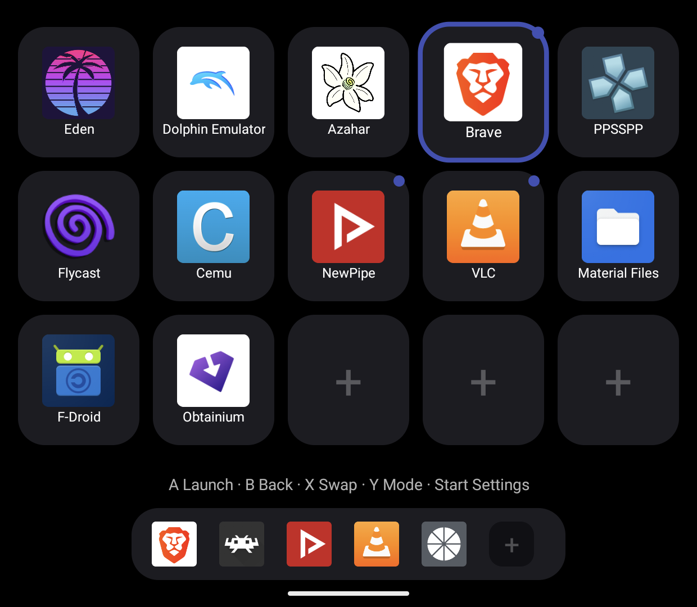
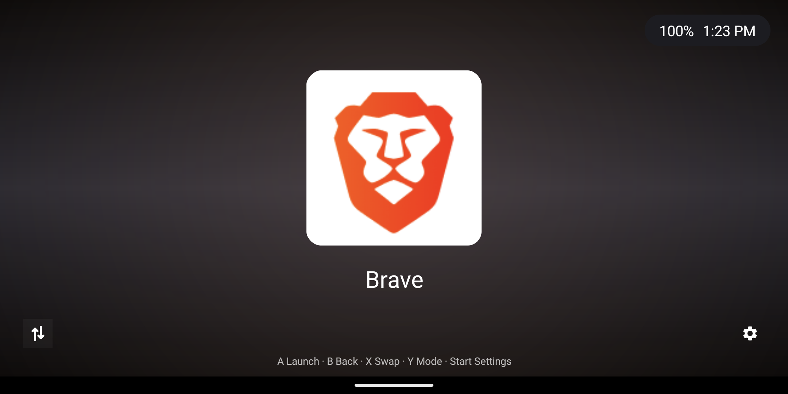
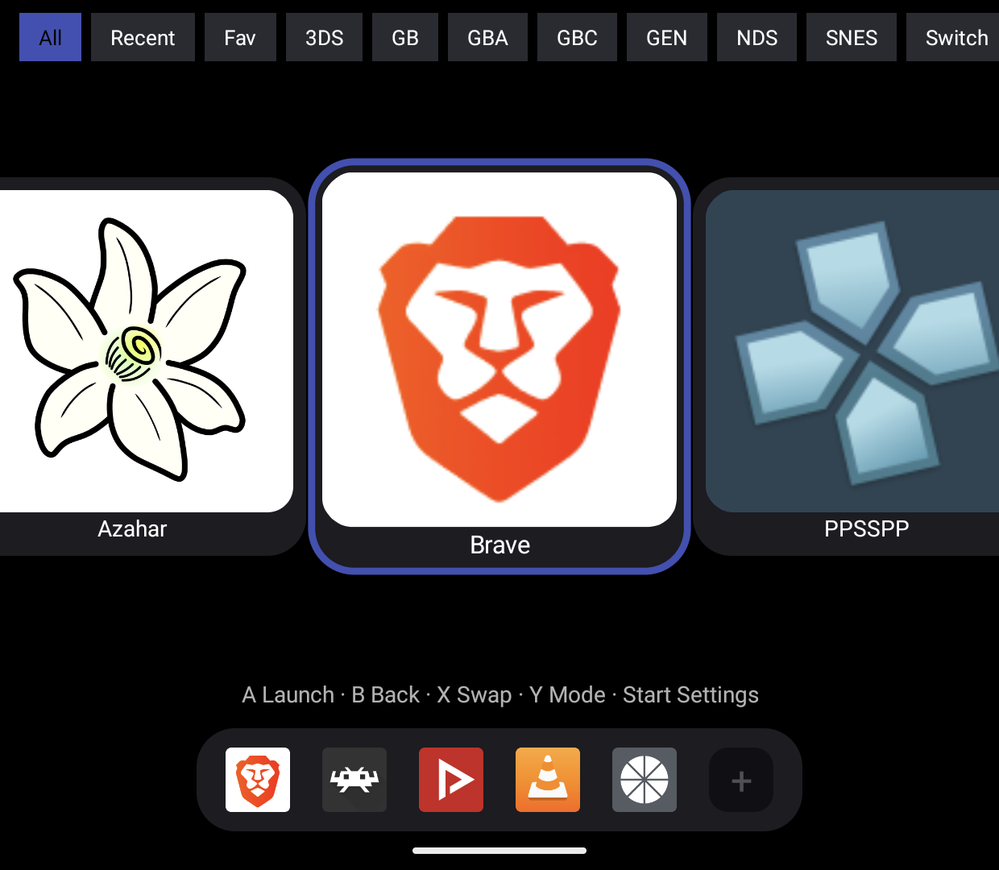
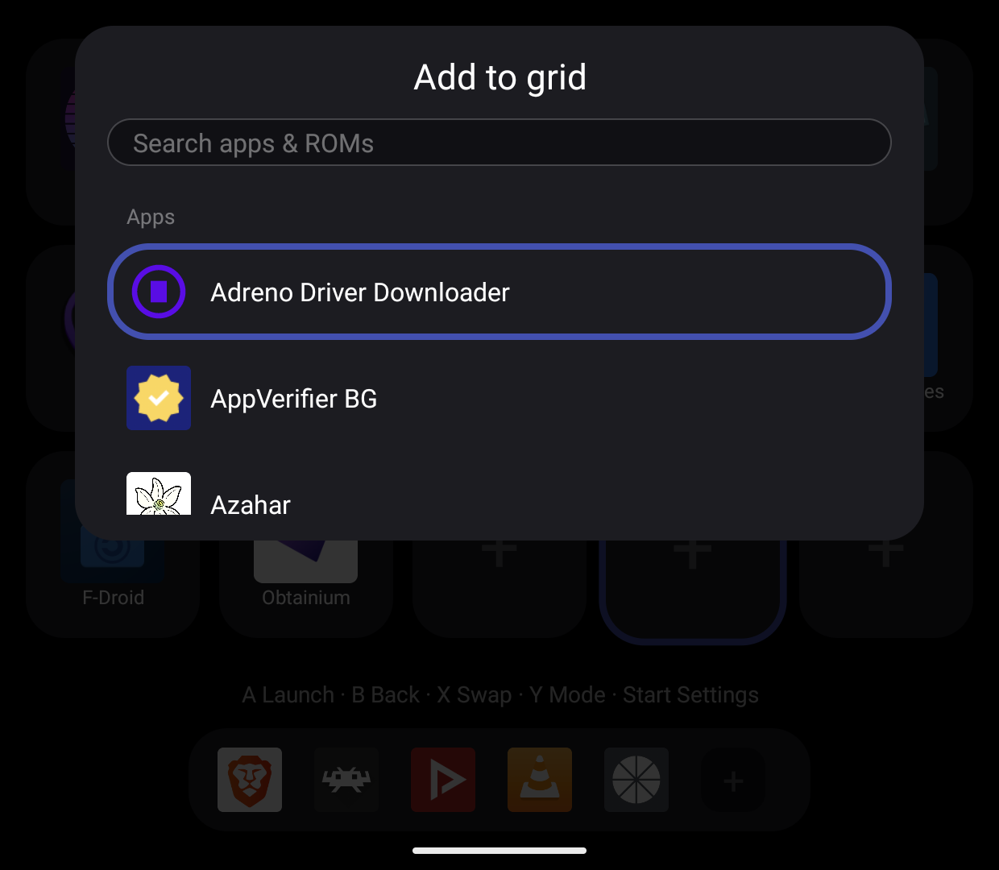

<p align="center">
  
</p>

<h1 align="center">Ghost Galleon</h1>
<p align="center"><i>Ghost Galleon Dual Screen Launcher</i></p>

<p align="center">
  <b>A dual-screen Android launcher built for the One X Sugar handheld.</b>
  <br />
  Grid Mode (3DS/Wii-style icon grid + dock) and Game Mode (card carousel) across one or two displays,
  <br />
  with portable display topology, live screen swap, remappable gamepad input, and a SAF-scanned ROM library.
</p>

<p align="center">
  <a href="https://github.com/visorcraft/GhostGalleon/releases/latest"></a>
  
  
  
  
</p>

---

## Screenshots

<table>
  <tr>
    <td width="50%">
      
      <br />
      <sub><b>Grid Mode</b> - curated 3DS-style grid, blank "+" slots, and the dock.</sub>
    </td>
    <td width="50%">
      
      <br />
      <sub><b>Hero panel</b> - the companion display previews the current selection.</sub>
    </td>
  </tr>
  <tr>
    <td width="50%">
      
      <br />
      <sub><b>Game Mode</b> - Daijisho/GameDeck-style card carousel.</sub>
    </td>
    <td width="50%">
      
      <br />
      <sub><b>Picker</b> - search apps and ROMs to fill any grid or dock slot.</sub>
    </td>
  </tr>
</table>

---

## What is Ghost Galleon?

Ghost Galleon is a home-screen replacement for Android handhelds. It is **built and QA’d on the One X Sugar** (Android 14, top 2160×1080 + bottom 1240×1080) and also runs on **single-display** devices via Auto topology.

On dual-screen hardware one panel hosts the interactive deck (grid or carousel) while the other shows a companion surface (hero preview, Now Playing, Perf HUD, or a pinned app). Ghost Galleon holds the Android **HOME** role (and **SECONDARY_HOME** on dual panels), is designed for full gamepad control, and supports swipe-up all-apps.

### Highlights

- **Grid Mode** — curated 3DS/Wii-style icon grid with dock, blank “+” slots, favorites, folders, pin/unpin to dock. Long-press opens a **sectioned, scrollable** context menu with **Remove from grid** near the top (Arrange → Dock → Library → Customize → More). **Search library** stays in Grid (adds to a blank slot when the title is not already pinned).
- **Game Mode** — card carousel with a **minimal** default chip bar (All / Recent / Continue / Fav + platforms + Search/Select). Browse chips update the carousel **in place** (no dual-panel flash). Counts on chips, deep search, details sheets, multi-select bulk actions, and long-press menus for history/sort/related/collections. Power-user rails (Installed, Games, Top, Today, Week, Month, A–Z, New, Random, genre/developer/year chips, letter jump), launchable-only ROMs, Resume chip, clock/battery, and Quick Panel browse shortcuts are **opt-in** under Settings → Display & Grid → Browse chrome (Minimal / Custom / Full).
- **Portable display topology** — interactive vs companion vs launch from `DisplayManager` (no hard-coded 0/1). Profiles: Auto, One X Sugar, Generic dual, Single. Swap/Settings icons sit on the **physically larger** panel in DUAL.
- **Live screen swap** — X (default) swaps interactive and companion roles with a sticky pin; also recovers a stuck pure-black secondary panel.
- **Companion roles** — Hero, Now Playing, Perf HUD, or pinned app on the non-interactive panel. Hero uses a compact platform · play · player subline and readable action chips.
- **Global input** — gamepad, d-pad, stick, and touch route to the interactive deck regardless of focus; held directions auto-repeat. D-pad is remappable; stick deadzone is in Settings → Controls; Controller Lab can bind the last key.
- **Swipe-up / re-HOME drawer** — all-apps + ROMs without reloading the deck.
- **Quick Panel** — Select opens Wi‑Fi, Bluetooth, Display, Settings, Continue, Theme, Controller Lab, and Close; optional browse shortcuts follow Browse chrome settings.
- **ROM library** — 21 built-in platforms (including Vita and Windows/Winlator), SAF tree grants only, offline-first art, hidden-ROM controls, and optional SteamGridDB/RetroAchievements integrations.
- **Honest playtime** — sessions pause while the launcher is focused or the device sleeps.
- **Themes** — Ghost, Teal, OLED Black, Neon; optional custom theme JSON.
- **Performance-minded** — R8-minified release APK, single carousel snap path, DiffUtil browse updates, one-pass chip counts, JPEG tile cache + RGB_565 grid decode, art load coalescing + throttled disk LRU, O(1) ROM/app maps, in-place selection/browse/chrome paths, dual-paint thrash guards (see [dual-paint invariants](docs/dual-paint-invariants.md)).
- **Settings** — Display & Grid, Apps, Controls (Controller Lab), Library, Artwork & backup, Stats, System (topology diagnostics), About. Long-press the page menu to search.
- **Export/import** — full settings, layout, and ROM-library JSON, plus a zip of the artwork cache.
- **Localization** — complete English, Spanish, German, Thai, and French UI catalogs with Android per-app language support.
- **Optional platform packs** — extra platform/player JSON under `docs/platform-packs/` (loadable in Settings).

---

## Displays & topology

| Role | Meaning |
|------|---------|
| **Primary / interactive** | Grid or Game Mode (input target). |
| **Companion** | Other dual surface: hero / Now Playing / Perf / pin. |
| **Secondary home placement** | Panel where `CompanionActivity` runs (first non-default display). |
| **Larger display** | Physically largest panel — hosts Swap + Settings chrome in DUAL. |

On the **One X Sugar**, Auto/Sugar prefers the **bottom** panel for interactive content and the **top** for hero. System `SECONDARY_HOME` is absorbed so swipe-up does not thrash the deck.

**Settings → System** shows the resolved topology (e.g. `primary=1 companion=0 launch=0 secondaryHome=1 larger=0`) plus hardware readings. **Single-display** devices run in SINGLE mode.

Split-session ownership (dual-surface games keep both panels; single-surface
games keep a live companion) is specified in
[`docs/split-session-ownership.md`](docs/split-session-ownership.md).
The KEEP play surface (HUD, session switcher, pixel oracle, RetroArch
link) is specified in
[`docs/keep-play-surface.md`](docs/keep-play-surface.md).

---

## ROM library

Scans use Storage Access Framework tree grants only — no broad storage permission.

- **Grant:** Settings → Library → “Add ROM folder”.
- **Scan:** grant triggers a scan; “Rescan library” walks trees off the UI thread. Index is cached as JSON.
- **Matching:** extension + platform folder name (tree root or first path segment, case-insensitive). Disc sets prefer `.m3u` / `.cue` over sibling `.bin`; BIOS/firmware folders are skipped.
- **Grid:** tap “+” → searchable picker (apps + ROMs).
- **Carousel:** Game Mode lists apps and ROMs with filters; Switch updates/DLC are deduped when a base package is present.
- **Launch:** prefers the non-interactive (launch) display so the deck stays put.

| Built-in platforms | Primary registered player | Device status |
|---|---|---|
| GB / GBC / GBA / NES / SNES / Genesis / N64 / PS1 / Saturn / Arcade | Platform-specific RetroArch cores | GBA and SNES verified; remaining templates registered |
| Nintendo DS | melonDualDS | verified |
| Nintendo 3DS | Azahar | verified |
| Nintendo Switch | Eden | verified |
| PSP | PPSSPP | package + launch plan verified; ROM content smoke when library has ISOs |
| PlayStation 2 | NetherSX2 | package + pathOrUri bootPath plan verified; content smoke optional |
| Dreamcast | Flycast | package + launch plan verified; content smoke when library has discs |
| GameCube / Wii | Dolphin | package + AutoStartFile pathOrUri plan verified |
| Wii U | Cemu | package + VIEW EmulationActivity plan verified |
| PlayStation Vita | Vita3K | `title_id` / `game_title` on current `Emulator`; eboot + VPK `param.sfo` scan |
| Windows | Winlator | `shortcut_path` pathOrUri; home MainActivity fallback |

Alternate players are available where the registry defines them. Windows titles
can be pinned as Android app launches, and Winlator is also a built-in Windows ROM platform (`.exe` / `.desktop` shortcuts).

---

## Artwork

Offline-first. Tiles, carousel cards, and hero use box art when available.

- **Local:** `images/` / `media/` / `art/` next to ROMs (romm layout), cached privately. Logos/wheels fill tiles when box art is missing and show on the hero.
- **SteamGridDB (optional):** Settings → Library → API key → “Download missing artwork”, or per-title **Download missing art** from a ROM’s menu. Pause below a battery floor (0 = off). Per-title match pick can show thumbnails for grid/hero/logo.
- **Arcade titles:** a bundled FBNeo + MAME 2010/2003-Plus + HBMAME/Neo Geo name catalog is shipped in the APK. Settings → Library → Import arcade DAT overlays a user XML or ClrMame Pro DAT on top; long-press the row to clear. A small compiled fallback remains if the catalog is missing.
- **RetroAchievements (optional):** username + API key for hero progress when configured.

---

## Permissions & data access

Ghost Galleon requests Android's `INTERNET` permission (optional SteamGridDB
and RetroAchievements) and `SET_WALLPAPER` (one-shot solid-black system
wallpaper so the Quickstep HOME gesture does not flash stock art). All other
launcher behavior is offline. ROM folders and custom artwork use user-selected,
persistent Storage Access Framework grants; the app requests no broad storage
permission.

---

## Default controls

| Button | Action |
|---|---|
| D-pad / left stick / HAT | Navigate (auto-repeat when held) |
| Down from last grid row / carousel | Focus dock |
| A / Enter | Launch |
| Tap | Focus; tap again to launch |
| Long-press | Grid: sectioned menu (Move, **Remove from grid**, pin, favorite, customize…); dock: Move/Remove; Game Mode: details / collections / pin / stats |
| B | Back |
| X | Swap interactive / companion |
| Y | Toggle Grid / Game mode |
| Start | Settings |
| Select | Quick Panel |
| L1 / R1 | Page |
| Swipe up / re-HOME | All-apps drawer |

Remap everything under Settings → Controls. Controller Lab is available for capture/testing.

---

## Settings map

| Page | Contents |
|------|----------|
| **Display & Grid** | Orientation, hints, default mode, themes, wallpaper, device profile, interactive display, companion role, **Browse chrome** (Minimal / Custom / Full + per-feature toggles), grid layout |
| **Apps** | Hidden apps, dock management |
| **Controls** | Haptics, remappable keys, Controller Lab |
| **Library** | ROM folders, Hidden ROMs, rescan, SteamGridDB, RetroAchievements, export/import, platform packs |
| **Stats** | Most played / recently played |
| **System** | Topology (primary / companion / launch / secondaryHome / larger), hardware readings |
| **About** | Version, git SHA, credits, licenses |

---

## Languages & localization

Ghost Galleon ships complete UI catalogs for:

| Language | Android locale | Resources |
|---|---|---|
| English | `en-US` | `app/src/main/res/values/` |
| Español | `es` | `app/src/main/res/values-es/` |
| Deutsch | `de` | `app/src/main/res/values-de/` |
| ไทย | `th` | `app/src/main/res/values-th/` |
| Français | `fr` | `app/src/main/res/values-fr/` |

Android selects the compiled catalog from the system/app language. On Android 13+
the language can also be chosen from Android's per-app language settings. AGP
generates the supported-locale config from these resource directories, so there is
no manual locale list in the app.

Static UI prose and grammatical counts live in
`app/src/main/res/values/strings.xml` and `plurals.xml`. Android-free domain code
returns typed `UiText`, which Android resolves only at view, dialog, toast, or
accessibility boundaries. Brands, URLs, technical
identifiers, legal IDs, and glyphs live separately in
`strings_nontranslatable.xml`. App/ROM titles, user names, hardware values, and
imported metadata remain dynamic.

Localized About prose lives in `raw-<locale>/acknowledgments.txt` and
`runtime_components.txt`. GPL and third-party license texts remain their
authoritative untranslated versions.

When changing UI text:

1. Update base English plus every supported `values-<locale>` catalog.
2. Preserve numbered format placeholders and locale-specific plural grammar.
3. Update localized About documents when their English source changes.
4. Regenerate the exhaustive inventory with `python3 scripts/i18n_audit.py --write`.
5. Run audit, lint, unit tests, and both APK builds; verify long text on both displays.

[`docs/localization-inventory.md`](docs/localization-inventory.md) lists every key,
all five catalogs, every plural, localized raw documents, intentional
non-translatable values, and translator checks. It is generated; do not hand-edit it.

---

## Build from source

Requires JDK **17** and Android SDK **34** (`sdk.dir` in local-only
`local.properties`). The app uses minSdk **26** and target/compileSdk **34**.

```bash
git clone https://github.com/visorcraft/GhostGalleon.git
cd GhostGalleon

python3 scripts/i18n_audit.py --check
./gradlew :app:testDebugUnitTest :app:lintDebug :app:assembleDebug
adb install --no-streaming -r app/build/outputs/apk/debug/app-debug.apk
```

Signed release builds require local `release-signing.properties`:

```bash
./gradlew :app:clean :app:assembleRelease
sha256sum app/build/outputs/apk/release/app-release.apk
adb install --no-streaming -r app/build/outputs/apk/release/app-release.apk
adb shell cmd package set-home-activity --user 0 \
  com.visorcraft.ghostgalleon/com.visorcraft.ghostgalleon.ui.MainActivity
adb shell am force-stop com.visorcraft.ghostgalleon
adb shell input keyevent HOME
```

Release builds enable **R8 minify + resource shrink** (`app/proguard-rules.pro`).
The One X Sugar can keep the old process alive and clear its HOME default during
an update, so force-stop and restore HOME after every reinstall. Debug and release
use different signing keys; switching between them requires uninstalling first.
Export settings from Settings → Library before uninstalling.

### Host unit tests

```bash
./gradlew :app:testDebugUnitTest
```

Pure modules under `display/`, typed localization text, settings migrations,
library browse/stats, dual-paint policy, and input maps are covered without a
device. Dual-screen paint rules live in
[`docs/dual-paint-invariants.md`](docs/dual-paint-invariants.md).

---

## Releases & updates

Download the signed `app-release.apk` from the
[GitHub releases page](https://github.com/visorcraft/GhostGalleon/releases).
On-device updates use Obtainium with GitHub releases as the source.

A one-shot **BlackPearl → Ghost Galleon** package bridge exists for data migration
(`-PbridgeBlackPearl=true`); normal users install only the
`com.visorcraft.ghostgalleon` release. SAF grants cannot migrate between package
names, so migrated users must select their ROM folders again.

---

## Dual-screen recovery

If one or both panels go **pure black** while the process is still running
(often after heavy HOME / SECONDARY_HOME thrash or a stuck companion surface):

1. Force-stop the app (system App Info, or `adb shell am force-stop com.visorcraft.ghostgalleon`), then press HOME.
2. Press **X** once or twice to swap interactive / companion roles.
3. Launch any game and return to the launcher (companion panel restarts).
4. Reboot if buffers stay stuck.

After sideloading an update, always force-stop once — some devices keep the
previous process alive across install. Paint thrash rules and agent checklist:
[dual-paint invariants](docs/dual-paint-invariants.md).

---

## Documentation

- [Credits & attribution](CREDITS.md) and [third-party licenses](docs/credits-third-party.md) — also in-app under Settings → About.
- [Dual-paint / black-screen invariants](docs/dual-paint-invariants.md) — dual-display paint thrash rules and recovery.
- Complete [localization inventory](docs/localization-inventory.md) and translator checklist.
- Example [platform packs](docs/platform-packs/).
- [GitHub releases](https://github.com/visorcraft/GhostGalleon/releases)

---

## License

Ghost Galleon is free and open-source software under the
[GNU General Public License v3.0](LICENSE). Bundled libraries are Apache-2.0;
see [CREDITS.md](CREDITS.md) for the full attribution record.
